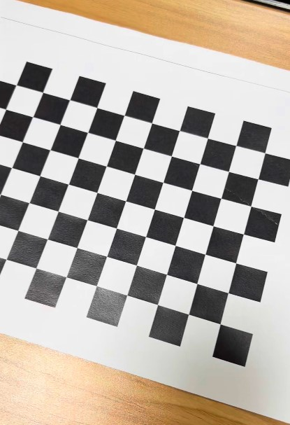

# 🧮 Homework #3 - Camera Calibration

## 📌 과제 개요
카메라 영상 내에서 촬영된 체스보드 패턴을 활용해 **내 카메라의 내·외부 파라미터(Camera Matrix, Distortion Coefficients 등)** 를 추정하고, 왜곡된 이미지를 보정하는 것이 본 과제의 목표입니다.

---

## 📁 프로젝트 구조

📦camera_calibration_hw3 ┣ 📂frames/ # 검출된 체스보드 코너 시각화 이미지 저장 ┃ ┣ corner_1.png ┃ ┣ corner_2.png ┃ ┗ ... ┣ 📹 chessboard.mp4 # 직접 촬영한 체스보드 영상 ┣ 🖼️ test_image.jpg # 왜곡 보정 테스트용 체스보드 이미지 ┣ 🧠 camera_calibration.py # 체스보드 코너 검출 및 파라미터 계산 스크립트 ┣ 🧠 distortion_correction.py # 왜곡 이미지 보정 스크립트 ┣ 🧠 check_camera_params.py # 저장된 .npz 파일 내 파라미터 확인용 ┣ 📦 camera_params.npz # 캘리브레이션 결과 저장파일 ┗ 📄 README.md # 과제 설명 및 사용 가이드

yaml
Copy
Edit

---

## 🎥 체스보드 영상 촬영

- **사용 장비**: 노트북 내장 카메라
- **촬영 조건**:
  - 다양한 각도에서 체스보드 촬영
  - A4 용지 출력 (출처: [Chessboard Collection](https://calib.io/pages/downloads))

> 영상 예시:
> 

---

## 📍 1. 카메라 캘리브레이션 (`camera_calibration.py`)

### ▶ 주요 처리 흐름

1. 영상에서 프레임 추출
2. 각 프레임에서 체스보드 코너 검출 (`cv2.findChessboardCorners`)
3. 검출된 코너를 저장하고 시각화 (`cv2.drawChessboardCorners`)
4. 코너 좌표를 바탕으로 카메라 캘리브레이션 수행 (`cv2.calibrateCamera`)
5. 결과 저장 (`camera_params.npz`)

### ▶ 출력 예시
```text
Camera matrix:
[[9.0039384e+03 0.0000000e+00 9.9216086e+02]
 [0.0000000e+00 1.8949796e+03 5.0234846e+02]
 [0.0000000e+00 0.0000000e+00 1.0000000e+00]]

Distortion coefficients:
[[ 2.322465e-01 -1.917289e+00 -2.201176e-03 -2.026461e-03 5.093349e+00]]

Reprojection error (RMSE): 2.1978...

---

### 📂 2. 파라미터 확인 (`check_camera_params.py`)

### ▶ 코드
```python
import numpy as np

data = np.load('camera_params.npz')

print("✅ Camera matrix:\n", data['mtx'])
print("✅ Distortion coefficients:\n", data['dist'])
print("✅ Reprojection error (RMSE):", data['error'])
